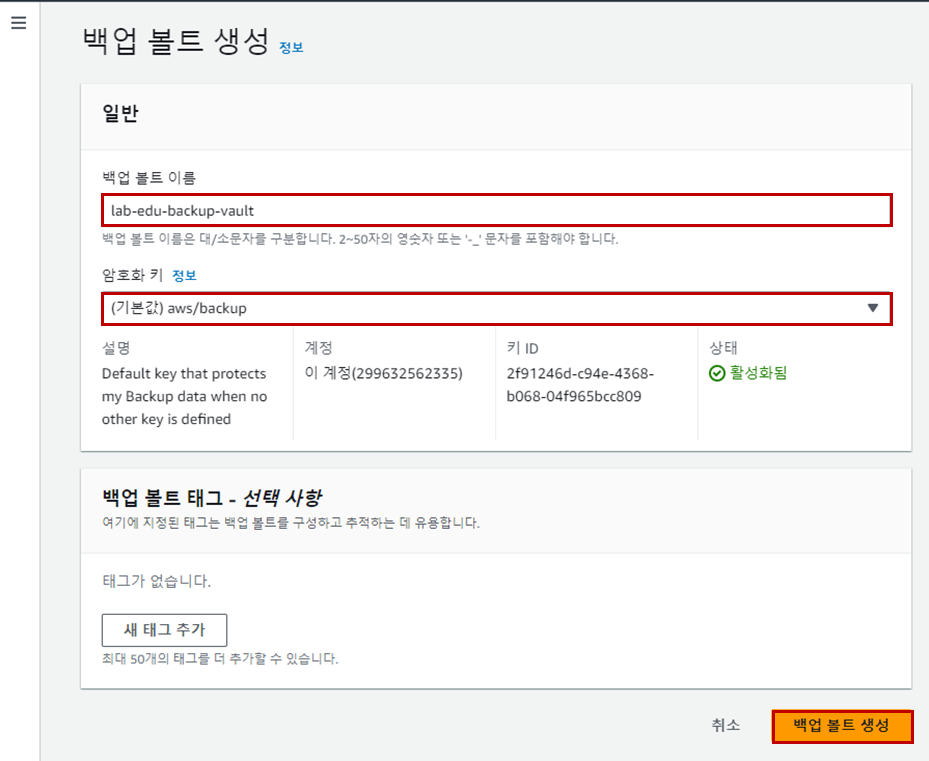
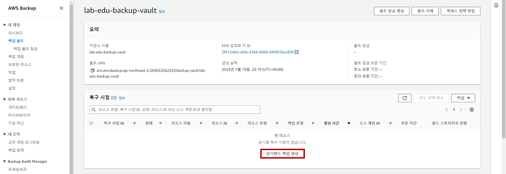
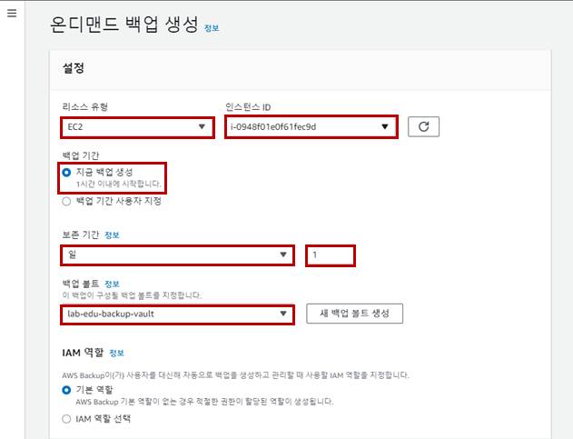
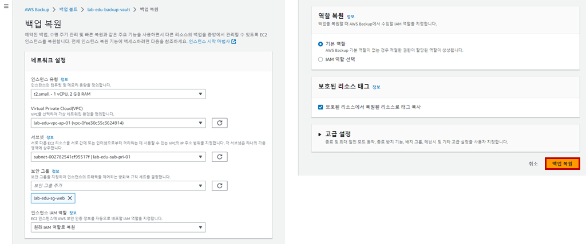
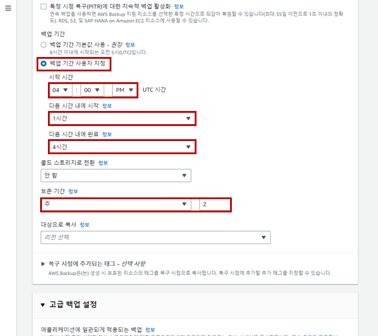
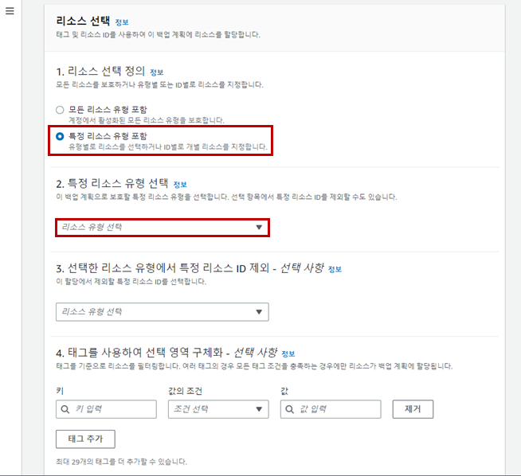

# AWS Backup 온디맨드 방식

### 1. Backup Vault 생성

- **Backup 메인 콘솔 화면 → '볼트' 리소스 탭 → "백업 볼트 생성" 버튼 클릭**

    

- Backup Vault 생성 정보 입력

    - 백업 볼트 이름: lab-edu-backup-vault

    - 암호화 키: (기본값) aws/backup

    - '백업 볼트 생성' 버튼 클릭

        

### 2. 온디맨드 백업 생성

- **Backup 메인 콘솔 화면 → '볼트' 리소스 탭 → *"lab-edu-backup-vault"* 선택**

    

- '온디맨드 백업 생성' 버튼 클릭

    

- 온디맨드 백업 생성 정보 입력

    - 리소스 유형: EC2

    - 인스턴스 ID: lab-edu-ec2-web

    - 백업 기간: 지금 백업 생성

    - 보존 기간: 일/1

    - 백업 볼트: lab-edu-backup-vault

        

    - '새 태그 추가' 버튼 클릭

    - 키: Name

    - 값: lab-edu-ec2-web-restore

    - '백업 볼트 생성' 버튼 클릭

        

### 3. 백업 파일 이용 서버 복원

- **Backup 메인 콘솔 화면 → '볼트' 리소스 탭 → *"lab-edu-backup-vault"* 선택**

- *'lab-edu-ec2-web-restore'* 선택 → '작업' 버튼 클릭 → '복원' 버튼 클릭

    

- '백업 복원' 버튼 클릭

    
  

# AWS Backup Plan 방식

### 1. 백업 계획 생성

- **Backup 메인 콘솔 화면 → '백업 계획' 리소스 탭 → "백업 계획 생성" 버튼 클릭**

- 백업 계획 생성 정보 입력

    - 백업 계획 옵션 : 새 계획 수립

    - 백업 계획 이름 : lab-edu-backup-plan-computing

    - 백업 규칙 이름 : lab-edu-backup-rule-computing

    - 백업 볼트 : lab-edu-backup-vault

    - 백업 빈도 : 매일

        

    - 백업 기간 : 백업 기간 사용자 지정

    - 시작 시간 : 04:00 PM (한국 시간으로 오전 1시)

    - 다음 시간 내에 시작 : 1시간

    - 다음 시간 내에 완료 : 4시간

    - 보존 기간 : 2

    - '백업 계획 생성' 버튼 클릭

        

### 2. 백업 리소스 생성

- 백업 리소스 생성 정보 입력

    - 리소스 할당 이름 : lab-edu-backup-resource-computing

        

    - 리소스 선택 정의 : 특정 리소스 유형 포함

    - 특정 리소스 유형 선택 : EC2

    - 리소스 유형 : EC2

    - 인스턴스 ID : 모든 인스턴스

    - '리소스 할당' 버튼 클릭

        

