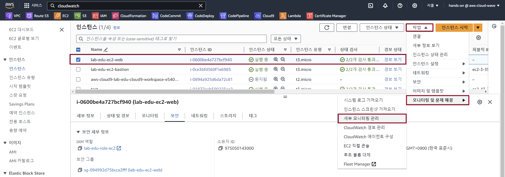
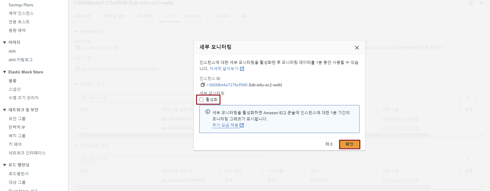
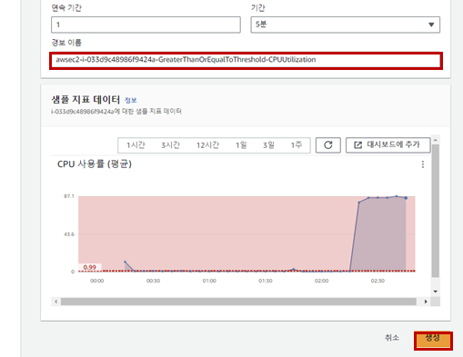
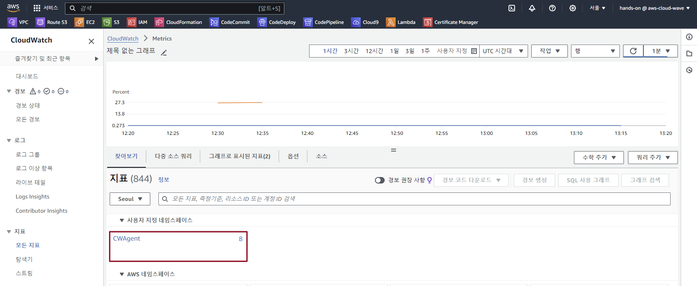

# CloudWatch 생성 및 SNS 연동

### 1. SNS 생성

- **SNS 콘솔 메인 화면 → 주제 이름 입력: 'lab-edu-sns-cloudwatch' → "다음 단계" 버튼 클릭**

- '주제 생성' 버튼 클릭

- 생성 결과 화면 하단의 '구독 생성' 버튼 클릭 

- 구독 생성 정보 입력

    - 프로토콜: 이메일

    - 엔드포인트: 수신 Email 주소 입력 (개인 이메일 주소)

    - '구독 생성' 버튼 클릭

- 이메일 접속 → 'Subscription Confirmation' 메일 확인 → 'Confirm subscription' 클릭

### 2. CloudWatch Alarm 생성

- **EC2 콘솔 메인 화면 → 인스턴스 탭 → 'lab-edu-ec2-web' 선택 → '작업' → '모니터링 및 문제해결' → '세부 모니터링 관리' 버튼 클릭**

    

- '세부 모니터링' 설정 체크박스의 '활성화' 체크 박스 활성화 → '확인' 버튼 클릭

    

- EC2 콘솔 메인 화면 → 인스턴스 탭 → 'lab-edu-ec2-web' 선택 → '작업' → '모니터링 및 문제해결' → 'CloudWatch 경보 관리' 버튼 클릭

    

- 경보 생성 정보 입력

    - 경보알림: lab-edu-sns-cloudwatch
    
    - 경보 임계값
    
        - 샘플 그룹화 기준: 평균
    
        - 샘플링 할 데이터 유형: CPU 사용률
    
        - 경보 시기: >=
    
        - %: 60
    
            

        - 연속 기간: 1
    
        - 기간 : 5분
    
        - 경보 이름: lab-edu-alarm-CPUUtilization

      - '생성' 버튼 클릭

          

### 3. 경보 생성 테스트

- 웹 서비스 접속 (*https://www.stxx.cj-cloud-wave.com*)

- 서버 부하 발생을 위해 'Stress Tool' 클릭

- 알람 수신을 위해 입력한 이메일로 접속해 알람 발생 여부 확인


### 4. CloudWatch Metric 수집 결과 확인

- **EC2 콘솔 메인 화면 → 인스턴스 탭 → 'lab-edu-ec2-web' 선택 → '인스턴스 ID 복사'**

    

- **CloudWatch 콘솔 메인 화면 → 모든 지표 탭 → 'lab-edu-ec2-web' ID 검색창에 입력 → 'CPUUtilization' 검색창에 입력**

- 'EC2 > 인스턴스 별 지표' 선택 → 'lab-edu-ec2-web' 선택 → '그래프' 확인

        
<br><br>

# CloudWatch Agent 이용 커스텀 Metric 수집

### 1. Web 서버 접속 및 Agent 설치

- Cloud9 IDE Terminal 접속 → SSH 명령어 실행

    ```bash
    ssh web-server
    ```

    ```bash
    sudo yum install amazon-cloudwatch-agent
    ```

- CloudWatch Agent 설정 파일 실행

    ```bash
    cd /opt/aws/amazon-cloudwatch-agent/bin/
    sudo ./amazon-cloudwatch-agent-config-wizard
    ```

- CloudWatch Agent Config 파일 설정

    ```bash
    ================================================================
    = Welcome to the Amazon CloudWatch Agent Configuration Manager =
    =                                                              =
    = CloudWatch Agent allows you to collect metrics and logs from =
    = your host and send them to CloudWatch. Additional CloudWatch =
    = charges may apply.                                           =
    ================================================================
    On which OS are you planning to use the agent?
    1. linux
    2. windows
    3. darwin
    default choice: [1]:

    Trying to fetch the default region based on ec2 metadata...
    I! imds retry client will retry 1 timesAre you using EC2 or On-Premises hosts?
    1. EC2
    2. On-Premises
    default choice: [1]:

    Which user are you planning to run the agent?
    1. cwagent
    2. root
    3. others
    default choice: [1]:
    
    Do you want to turn on StatsD daemon?
    1. yes
    2. no
    default choice: [1]:
    #2
    Do you want to monitor metrics from CollectD? WARNING: CollectD must be installed or the Agent will fail to start
    1. yes
    2. no
    default choice: [1]:
    #2
    Do you want to monitor any host metrics? e.g. CPU, memory, etc.
    1. yes
    2. no
    default choice: [1]:

    Do you want to monitor cpu metrics per core?
    1. yes
    2. no
    default choice: [1]:

    Do you want to add ec2 dimensions (ImageId, InstanceId, InstanceType, AutoScalingGroupName) into all of your metrics if the info is available?
    1. yes
    2. no
    default choice: [1]:

    Do you want to aggregate ec2 dimensions (InstanceId)?
    1. yes
    2. no
    default choice: [1]:

    Would you like to collect your metrics at high resolution (sub-minute resolution)? This enables sub-minute resolution for all metrics, but you can customize for specific metrics in the output json file.
    1. 1s
    2. 10s
    3. 30s
    4. 60s
    default choice: [4]:

    Which default metrics config do you want?
    1. Basic
    2. Standard
    3. Advanced
    4. None
    default choice: [1]:
    #3
    Current config as follows:
    {
            "agent": {
                    "metrics_collection_interval": 60,
                    "run_as_user": "cwagent"
            },
            "metrics": {
                    "aggregation_dimensions": [
                            [
                                    "InstanceId"
                            ]
                    ],
                    "append_dimensions": {
                            "AutoScalingGroupName": "${aws:AutoScalingGroupName}",
                            "ImageId": "${aws:ImageId}",
                            "InstanceId": "${aws:InstanceId}",
                            "InstanceType": "${aws:InstanceType}"
                    },
                    "metrics_collected": {
                            "cpu": {
                                    "measurement": [
                                            "cpu_usage_idle",
                                            "cpu_usage_iowait",
                                            "cpu_usage_user",
                                            "cpu_usage_system"
                                    ],
                                    "metrics_collection_interval": 60,
                                    "resources": [
                                            "*"
                                    ],
                                    "totalcpu": false
                            },
                            "disk": {
                                    "measurement": [
                                            "used_percent",
                                            "inodes_free"
                                    ],
                                    "metrics_collection_interval": 60,
                                    "resources": [
                                            "*"
                                    ]
                            },
                            "diskio": {
                                    "measurement": [
                                            "io_time",
                                            "write_bytes",
                                            "read_bytes",
                                            "writes",
                                            "reads"
                                    ],
                                    "metrics_collection_interval": 60,
                                    "resources": [
                                            "*"
                                    ]
                            },
                            "mem": {
                                    "measurement": [
                                            "mem_used_percent"
                                    ],
                                    "metrics_collection_interval": 60
                            },
                            "netstat": {
                                    "measurement": [
                                            "tcp_established",
                                            "tcp_time_wait"
                                    ],
                                    "metrics_collection_interval": 60
                            },
                            "swap": {
                                    "measurement": [
                                            "swap_used_percent"
                                    ],
                                    "metrics_collection_interval": 60
                            }
                    }
            }
    }
    Are you satisfied with the above config? Note: it can be manually customized after the wizard completes to add additional items.
    1. yes
    2. no
    default choice: [1]:

    Do you have any existing CloudWatch Log Agent (http://docs.aws.amazon.com/AmazonCloudWatch/latest/logs/AgentReference.html) configuration file to import for migration?
    1. yes
    2. no
    default choice: [2]:

    Do you want to monitor any log files?
    1. yes
    2. no
    default choice: [1]:
    #2
    Do you want the CloudWatch agent to also retrieve X-ray traces?
    1. yes
    2. no
    default choice: [1]:
    #2
    Existing config JSON identified and copied to:  /opt/aws/amazon-cloudwatch-agent/etc/backup-configs
    Saved config file to /opt/aws/amazon-cloudwatch-agent/bin/config.json successfully.
    Current config as follows:
    {
            "agent": {
                    "metrics_collection_interval": 60,
                    "run_as_user": "cwagent"
            },
            "metrics": {
                    "aggregation_dimensions": [
                            [
                                    "InstanceId"
                            ]
                    ],
                    "append_dimensions": {
                            "AutoScalingGroupName": "${aws:AutoScalingGroupName}",
                            "ImageId": "${aws:ImageId}",
                            "InstanceId": "${aws:InstanceId}",
                            "InstanceType": "${aws:InstanceType}"
                    },
                    "metrics_collected": {
                            "cpu": {
                                    "measurement": [
                                            "cpu_usage_idle",
                                            "cpu_usage_iowait",
                                            "cpu_usage_user",
                                            "cpu_usage_system"
                                    ],
                                    "metrics_collection_interval": 60,
                                    "resources": [
                                            "*"
                                    ],
                                    "totalcpu": false
                            },
                            "disk": {
                                    "measurement": [
                                            "used_percent",
                                            "inodes_free"
                                    ],
                                    "metrics_collection_interval": 60,
                                    "resources": [
                                            "*"
                                    ]
                            },
                            "diskio": {
                                    "measurement": [
                                            "io_time",
                                            "write_bytes",
                                            "read_bytes",
                                            "writes",
                                            "reads"
                                    ],
                                    "metrics_collection_interval": 60,
                                    "resources": [
                                            "*"
                                    ]
                            },
                            "mem": {
                                    "measurement": [
                                            "mem_used_percent"
                                    ],
                                    "metrics_collection_interval": 60
                            },
                            "netstat": {
                                    "measurement": [
                                            "tcp_established",
                                            "tcp_time_wait"
                                    ],
                                    "metrics_collection_interval": 60
                            },
                            "swap": {
                                    "measurement": [
                                            "swap_used_percent"
                                    ],
                                    "metrics_collection_interval": 60
                            }
                    }
            }
    }
    Please check the above content of the config.
    The config file is also located at /opt/aws/amazon-cloudwatch-agent/bin/config.json.
    Edit it manually if needed.
    Do you want to store the config in the SSM parameter store?
    1. yes
    2. no
    default choice: [1]:
    #2
    Program exits now.
    ```

- CloudWatch config.json 설정 파일 적용

    ```bash
    sudo /opt/aws/amazon-cloudwatch-agent/bin/amazon-cloudwatch-agent-ctl -a fetch-config -m ec2 -c file:/opt/aws/amazon-cloudwatch-agent/bin/config.json -s
    ```

- CloudWatch 실행 및 상태 확인

    ```bash
    sudo amazon-cloudwatch-agent-ctl -m ec2 -a start
    sudo amazon-cloudwatch-agent-ctl -m ec2 -a status
    ps -ef|grep amazon-cloudwatch-agent
    ```

### 2. CloudWatch Agent로 수집된 데이터 확인

- **CloudWatch 콘솔 메인 화면 → 모든 지표 탭 → 'CWAgent' 선택 → 'ImageId, InstanceId, InstanceType' 선택**

    

- 'lab-edu-ec2-web' 선택 → '그래프' 확인

    